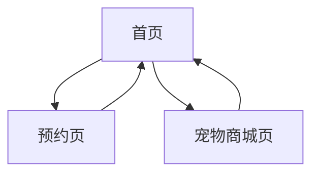

# 宠物店网页应用产品需求文档

## 1. 产品概述

一个温馨可爱的宠物店网页应用，提供宠物洗护预约服务和宠物展示功能。

* 解决宠物主人预约洗护服务的需求，提供便捷的在线预约体验

* 面向宠物主人和潜在宠物购买者，通过精美的界面展示宠物店的专业服务

* 目标是成为本地最受欢迎的宠物服务平台，提升客户满意度和业务转化率

## 2. 核心功能

### 2.1 用户角色

| 角色   | 注册方式 | 核心权限                |
| ---- | ---- | ------------------- |
| 普通用户 | 无需注册 | 可浏览所有页面、预约服务、查看宠物信息 |

### 2.2 功能模块

我们的宠物店应用包含以下主要页面：

1. **首页**：品牌展示、快速预约入口、用户评价、联系信息
2. **预约页**：时间轴选择、预约表单、套餐选择
3. **宠物商城页**：宠物展示、筛选功能、联系跳转

### 2.3 页面详情

| 页面名称  | 模块名称     | 功能描述                     |
| ----- | -------- | ------------------------ |
| 首页    | Banner区块 | 展示宠物洗护大图、品牌slogan、动画文字效果 |
| 首页    | 快速入口     | 大按钮样式的"预约洗护"入口，跳转到预约页    |
| 首页    | 用户口碑     | 卡片滑动组件，展示用户头像和评价内容       |
| 首页    | 联系我们     | 显示地图图片和联系电话信息            |
| 预约页   | 时间轴组件    | 横向时间轴，显示已占用时间段，支持点击选择    |
| 预约页   | 预约表单     | 输入宠物昵称、选择套餐、填写备注信息       |
| 预约页   | 时间冲突检测   | 实时检测时间重叠，红字提示并禁止提交       |
| 宠物商城页 | 宠物展示     | 展示猫狗照片、品种、性别、年龄信息        |
| 宠物商城页 | 筛选功能     | 按品种和价格区间筛选宠物             |
| 宠物商城页 | 联系按钮     | 每个宠物卡片包含联系按钮，跳转到首页联系模块   |

## 3. 核心流程

用户访问首页浏览服务信息，通过快速入口进入预约页面选择时间和套餐完成预约，或访问宠物商城页面浏览宠物信息并联系咨询。



## 4. 用户界面设计

### 4.1 设计风格

* 主色调：温暖明媚的橙色(#FF8C42)和柔和的粉色(#FFB6C1)

* 辅助色：清新的薄荷绿(#98FB98)和温暖的米色(#F5F5DC)

* 按钮样式：圆角设计，3D阴影效果，悬停时有温和的动画

* 字体：主标题使用可爱圆润字体16-24px，正文使用清晰易读字体14px

* 布局风格：卡片式设计，顶部导航栏，充足的留白空间

* 图标风格：可爱的宠物主题图标，线条柔和，色彩温暖

### 4.2 页面设计概览

| 页面名称  | 模块名称     | UI元素                     |
| ----- | -------- | ------------------------ |
| 首页    | Banner区块 | 全屏背景图，居中大标题，渐入动画效果，暖色调滤镜 |
| 首页    | 快速入口     | 大尺寸圆角按钮，橙色背景，白色文字，悬停放大效果 |
| 首页    | 用户口碑     | 圆形头像，卡片阴影，左右滑动指示器，星级评分   |
| 首页    | 联系我们     | 地图图片圆角边框，电话号码大字体显示，联系图标  |
| 预约页   | 时间轴组件    | 横向滚动条，已占用时段灰色显示，可选时段高亮   |
| 预约页   | 预约表单     | 圆角输入框，下拉选择器，提交按钮渐变色      |
| 宠物商城页 | 宠物展示     | 网格布局，圆角宠物照片，信息标签，联系按钮    |
| 宠物商城页 | 筛选功能     | 顶部筛选栏，标签式选择器，价格滑动条       |

### 4.3 响应式设计

桌面优先设计，移动端自适应，支持触摸交互优化，确保在手机和平板上的良好体验。

## 5. 数据库设计

### 5.1 套餐表 (packages)

| 字段名               | 数据类型          | 约束                         | 描述       |
| ----------------- | ------------- | -------------------------- | -------- |
| id                | SERIAL        | PRIMARY KEY                | 套餐ID     |
| name              | VARCHAR(100)  | NOT NULL                   | 套餐名称     |
| price             | DECIMAL(10,2) | NOT NULL                   | 套餐价格     |
| duration\_minutes | INTEGER       | NOT NULL                   | 服务时长(分钟) |
| description       | TEXT          | <br />                     | 套餐描述     |
| created\_at       | TIMESTAMP     | DEFAULT CURRENT\_TIMESTAMP | 创建时间     |
| updated\_at       | TIMESTAMP     | DEFAULT CURRENT\_TIMESTAMP | 更新时间     |

### 5.2 预约表 (appointments)

| 字段名            | 数据类型        | 约束                         | 描述   |
| -------------- | ----------- | -------------------------- | ---- |
| id             | SERIAL      | PRIMARY KEY                | 预约ID |
| pet\_name      | VARCHAR(50) | NOT NULL                   | 宠物昵称 |
| package\_id    | INTEGER     | NOT NULL, FOREIGN KEY      | 套餐ID |
| start\_time    | TIMESTAMP   | NOT NULL                   | 开始时间 |
| end\_time      | TIMESTAMP   | NOT NULL                   | 结束时间 |
| notes          | TEXT        | <br />                     | 备注信息 |
| contact\_phone | VARCHAR(20) | <br />                     | 联系电话 |
| status         | VARCHAR(20) | DEFAULT 'pending'          | 预约状态 |
| created\_at    | TIMESTAMP   | DEFAULT CURRENT\_TIMESTAMP | 创建时间 |
| updated\_at    | TIMESTAMP   | DEFAULT CURRENT\_TIMESTAMP | 更新时间 |

### 5.3 SQL建表语句

```sql
-- 创建套餐表
CREATE TABLE packages (
    id SERIAL PRIMARY KEY,
    name VARCHAR(100) NOT NULL,
    price DECIMAL(10,2) NOT NULL,
    duration_minutes INTEGER NOT NULL,
    description TEXT,
    created_at TIMESTAMP DEFAULT CURRENT_TIMESTAMP,
    updated_at TIMESTAMP DEFAULT CURRENT_TIMESTAMP
);

-- 创建预约表
CREATE TABLE appointments (
    id SERIAL PRIMARY KEY,
    pet_name VARCHAR(50) NOT NULL,
    package_id INTEGER NOT NULL,
    start_time TIMESTAMP NOT NULL,
    end_time TIMESTAMP NOT NULL,
    notes TEXT,
    contact_phone VARCHAR(20),
    status VARCHAR(20) DEFAULT 'pending',
    created_at TIMESTAMP DEFAULT CURRENT_TIMESTAMP,
    updated_at TIMESTAMP DEFAULT CURRENT_TIMESTAMP,
    FOREIGN KEY (package_id) REFERENCES packages(id)
);

-- 创建索引
CREATE INDEX idx_appointments_start_time ON appointments(start_time);
CREATE INDEX idx_appointments_package_id ON appointments(package_id);
```

## 6. 技术架构

### 6.1 前端技术栈

* React.js + TypeScript

* tailwind CSS+ 响应式设计

* 组件库：Ant Design 或 Material-UI

* 状态管理：React Hooks

### 6.2 后端技术栈

* Node.js + Express.js

* PostgreSQL 数据库

* RESTful API 设计

* 数据验证和错误处理

### 6.3 API 接口设计

* GET /api/packages - 获取套餐列表

* POST /api/appointments - 创建预约

* GET /api/appointments - 获取预约列表

  <br />

## 7. 特殊要求

### 7.1 时间处理

* 前端传递时间不带时区信息

* 使用浏览器本地时间

* 避免UTC时间转换问题

### 7.2 图片资源

* 宠物图片通过工具生成

* 可爱猫咪主题

* 高质量SVG格式优先

### 7.3 宠物商城数据

* 硬编码宠物数据

* 不需要数据库存储

* 包含品种、性别、年龄信息

  <br />

**7.4 预约界面**

* 使用前台逻辑判断时间是否冲突

<br />

<br />

